

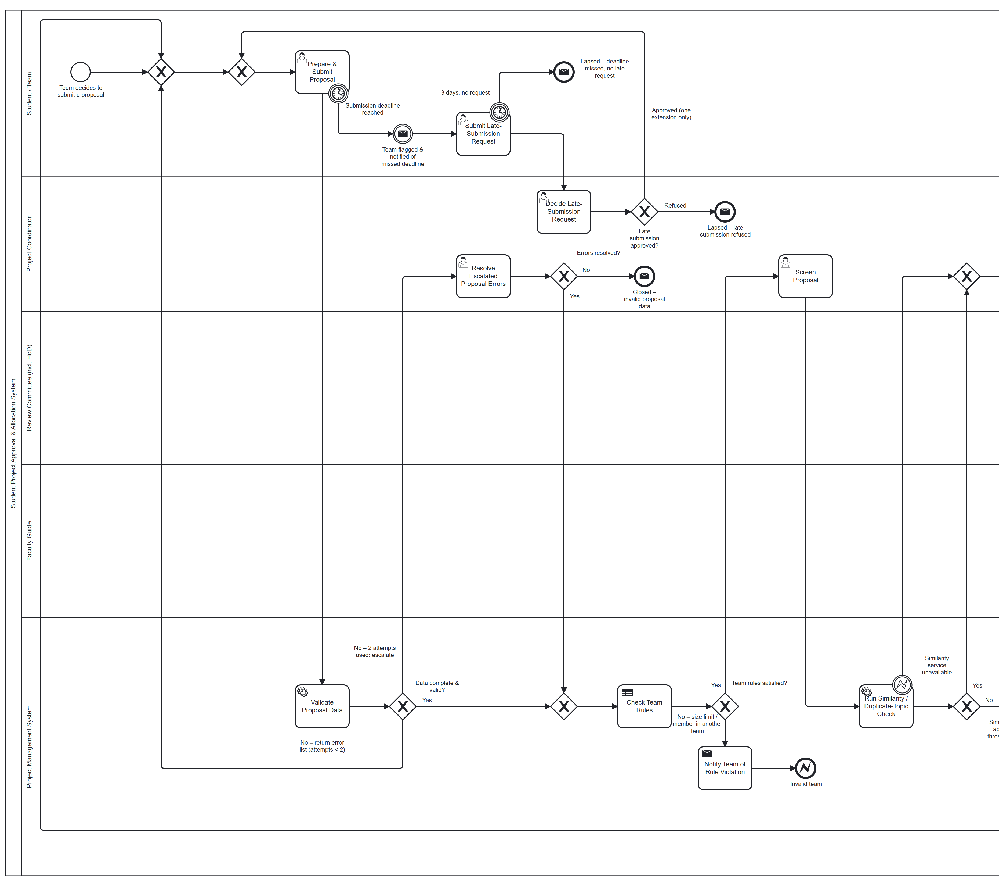
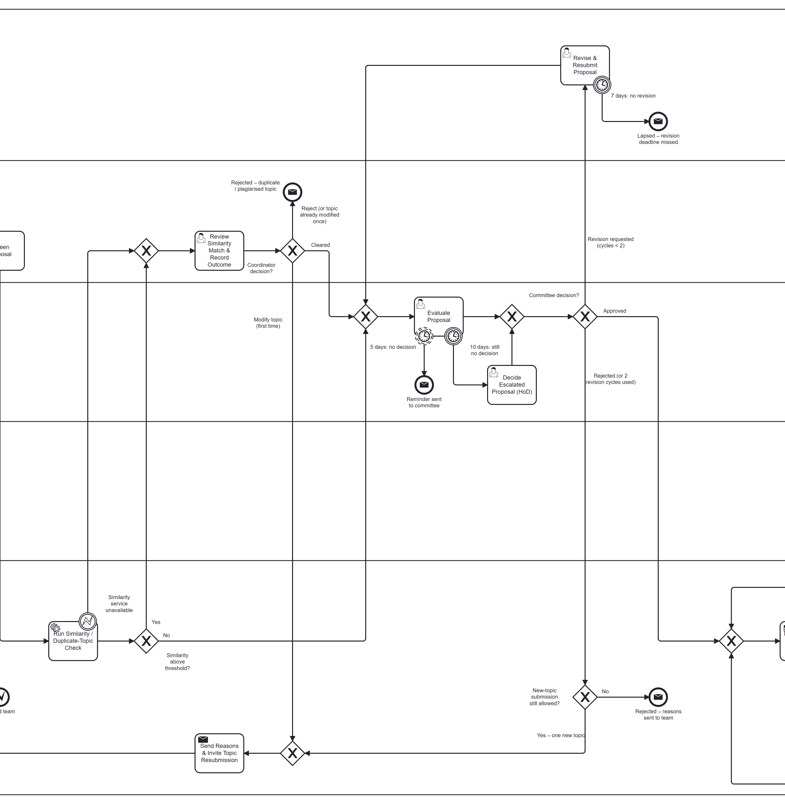
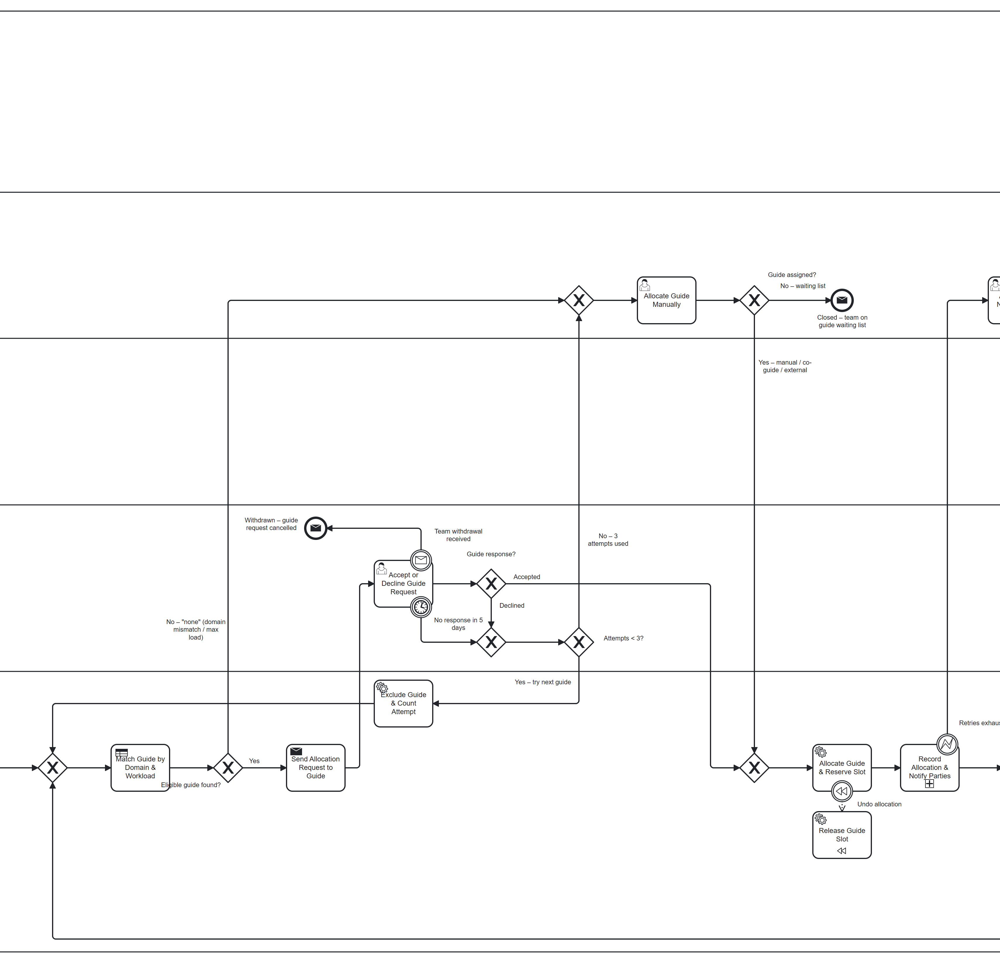
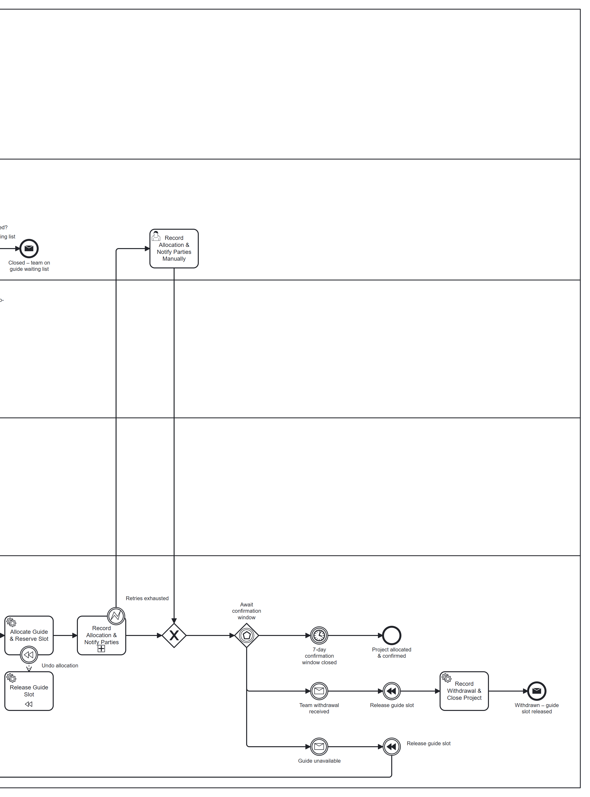
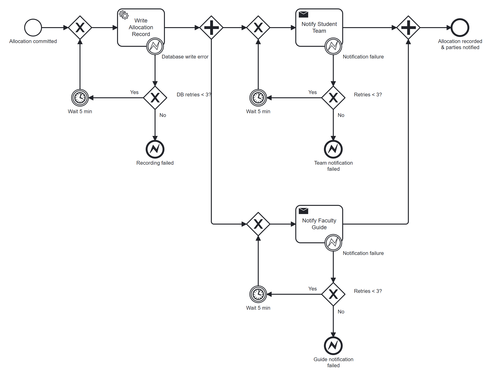

# Student Project Approval & Allocation System — BPMN 2.0 Model

**Assignment 1 · BPMN Project Assignments**

An editable BPMN 2.0 model of a department's final-year project approval and guide-allocation process: the happy path, thirteen failure paths with their resolutions drawn in the diagram, and the supporting documents. The scope of what is and is not modelled is stated under [Known limitations](#known-limitations).

| | |
|---|---|
| Editable model | [`bpmn/Student_Project_Approval.bpmn`](bpmn/Student_Project_Approval.bpmn) |
| Process overview | [`docs/Process_Overview.md`](docs/Process_Overview.md) |
| Failure Path Register (full) | [`docs/Failure_Path_Register.md`](docs/Failure_Path_Register.md) |
| Task and gateway justification (full) | [`docs/Task_Gateway_Justification.md`](docs/Task_Gateway_Justification.md) |
| Full diagram as PDF | [`exports/Student_Project_Approval_Full.pdf`](exports/Student_Project_Approval_Full.pdf) |

## Overview

A student team submits a project proposal. The system validates the data and the team rules, the coordinator screens it, a similarity check looks for duplicate topics, and the review committee approves, asks for revision, or rejects. After approval a guide is matched by domain and workload and asked to accept; the allocation is then recorded and communicated. The process ends when the allocation is confirmed, or when the proposal is closed as rejected, invalid, lapsed or withdrawn.

The model is one pool with five lanes:

| Lane | Responsibility |
|---|---|
| Student / Team | Submit, request late submission, revise |
| Project Coordinator | Screen, review similarity matches, decide late requests, handle escalations, allocate manually |
| Review Committee (incl. HoD) | Evaluate the proposal; the HoD decides when the committee is overdue |
| Faculty Guide | Accept or decline the allocation request |
| Project Management System | Validation, rules, similarity check, matching, notifications, recording |

## Diagrams

The full diagram is wide; click an image to open it at full resolution, or use the [PDF](exports/Student_Project_Approval_Full.pdf).

**Full process**

**Happy path** (green): submit → validate → team rules → screen → similarity check → committee approval → guide match → request → guide accepts → reserve slot → record and notify → confirmation window closes → *Project allocated & confirmed*.

**Failure paths** (red): every element not on the happy path — boundary events, retry and revision loops, escalation tasks and the non-success end events.

### Sections

The same diagram in four readable parts.

**1 — Submission and validation** (F1, F2, F4)

**2 — Screening and committee review** (F3, F5, F6, F7, F12)

**3 — Guide allocation** (F8, F9, F13)

**4 — Recording and confirmation window** (F10, F11)

**Sub-process "Record Allocation & Notify Parties"** (F10). It is collapsed in the main diagram, so its retry loops are only visible here.

## Failure Path Register (summary)

Detection mechanisms and the exact diagram labels for each row are in the [full register](docs/Failure_Path_Register.md).

| ID | Failure | BPMN solution | Limit | Outcome |
|---|---|---|---|---|
| F1 | Incomplete or invalid proposal data | Exclusive gateway after the validation service task; error list returned; escalation to coordinator | 2 attempts | Continues, or closed as invalid data |
| F2 | Team-rule violation (size, member in another team) | Business rule task, exclusive gateway, send task, error end event | — | "Invalid team" |
| F3 | Duplicate / plagiarised topic | Coordinator review task; gateway: cleared / modify topic / reject | 1 modification | Continues, resubmission, or rejected |
| F4 | Missed submission deadline | Timer boundary event; team notified; late request decided by coordinator | 3 days to request; 1 extension | Back to submission, or lapsed |
| F5 | Committee requests revision | Revision loop with timer boundary event | 7 days; 2 cycles | Back to review, lapsed, or rejection path |
| F6 | Committee rejects | Reasons sent; loop back to submission | 1 new topic | Resubmission, or rejected |
| F7 | Committee review delayed | Non-interrupting timer (reminder) and interrupting timer (HoD decides) | 5 days / 10 days | A decision is always produced |
| F8 | No suitable guide | Rule returns "none"; coordinator allocates manually, co-guide / external, or waiting list | — | Allocation continues, or waiting list |
| F9 | Guide declines or is silent | Gateway and timer boundary; guide excluded; matching re-run | 5 days; 3 attempts | Next guide, then manual allocation |
| F10 | Notification or database failure | Error boundary events with retry loops in a sub-process; coordinator fallback | 3 retries | Recorded automatically or manually |
| F11 | Withdrawal or guide unavailable after allocation | Event-based gateway; compensation releases the guide slot | 7-day window | Withdrawn, or back to guide matching |
| F12 | Similarity service unavailable *(added)* | Error boundary event → coordinator review | — | Same outcomes as F3 |
| F13 | Withdrawal while guide request is pending *(added)* | Message boundary event on the guide's task | — | Withdrawn, request cancelled |

End events: one success end (*Project allocated & confirmed*) and separate ends for rejected (2), invalid (2), lapsed (3), waiting list (1) and withdrawn (2). They are listed in the [register](docs/Failure_Path_Register.md#end-events).

## Task and gateway justification

The element-by-element version is in the [justification document](docs/Task_Gateway_Justification.md).

- **Task types.** Work a person does through a form is a user task in that person's lane. Automated work (validation, similarity call, database updates) is a service task in the system lane. The two policy decisions that are decision tables — team rules and guide matching — are business rule tasks. Pure notifications are send tasks.
- **Exclusive gateways.** Every decision picks exactly one path from data that already exists, so all decision gateways are exclusive, with a question label and a labelled, conditioned branch for each outcome. Merges are separate gateways; none both joins and splits.
- **Timer boundary events.** A deadline belongs to the task that is waiting, so each is a boundary event on that task. The committee task has two: a non-interrupting one for the reminder and an interrupting one for escalation to the HoD.
- **Error boundary events.** Used only for technical faults (similarity service, database write, notifications). Expected business outcomes such as "invalid" or "declined" are gateway branches.
- **Bounded loops.** Each loop is an explicit flow with a counter condition on the gateway that exits it.
- **Escalation.** Failed validation attempts, an unmatched guide, three failed allocation attempts and exhausted retries go to coordinator tasks; an overdue committee decision goes to the HoD. A BPMN escalation event is not used because nothing at process level would catch it.
- **Compensation.** "Allocate Guide & Reserve Slot" has a compensation boundary event linked to "Release Guide Slot", triggered when the team withdraws or the guide becomes unavailable.
- **Parallel gateway.** Used once, in the sub-process: notifying the team and the guide are independent and both required. Validation steps are sequential because each can stop the proposal.
- **Event-based gateway.** Used once, after allocation, to wait for whichever comes first: withdrawal, guide unavailability, or the confirmation timer.

## Validation

These checks were run on the committed BPMN file before the first push; the file has not changed since.

| Check | Tool | Result |
|---|---|---|
| Opens and imports both diagrams | Camunda Modeler 5.52.0 | Problems panel: "No problems found" |
| BPMN lint | `bpmnlint` 11.14.0, recommended rules | 0 errors, 0 warnings |
| Element typing and ID references | `bpmn-moddle` 10.3.1 | 0 warnings; all references resolve |
| Flow connectivity, reachability, dead ends, gateway joins and splits, boundary-event attachment, compensation links, loop bounds, lane placement, diagram completeness | [`tools/validate.mjs`](tools/validate.mjs) | All checks passed |
| Labels quoted in `docs/` exist in the model | Script comparison | All match |

Not performed: validation against the OMG BPMN 2.0 XSD, and execution or simulation on a process engine.

To re-run: `npm install`, then `npm run validate` and `npm run lint`.

**Images.** The diagrams were exported as SVG by Camunda Modeler 5.52.0 with this file open, then converted to PNG and PDF with headless Chrome; the section images are crops of the full export. The export was triggered by script rather than through the *File → Export as image* menu. The green and red colours were applied temporarily for the two highlighted images and are not stored in the BPMN file.

## Opening the model

1. Install [Camunda Modeler](https://camunda.com/download/modeler/) and open `bpmn/Student_Project_Approval.bpmn` with *File → Open File…*.
2. Click the small arrow on **Record Allocation & Notify Parties** to open the sub-process; use the breadcrumb at the top-left to return.
3. *File → Export as image…* exports the diagram currently shown.

The file is plain BPMN 2.0 and also opens in <https://demo.bpmn.io>.

## Known limitations

- The model is descriptive, not executable; counters in the branch conditions are not incremented by dedicated tasks.
- Technical retries (F10) are drawn only for the allocation record and its two notifications, not for the other notifications in the process.
- Withdrawal is handled while a guide request is pending (F13) and during the confirmation window (F11), not at every other step.
- The HoD's escalated decision has no further timer.
- With a single pool there are no message flows; communication is shown with send tasks and message events.
- Durations not given in the brief are assumptions, listed in the [register](docs/Failure_Path_Register.md#assumptions).
- Because of the lane order, several flows run vertically across lanes and a few cross.
