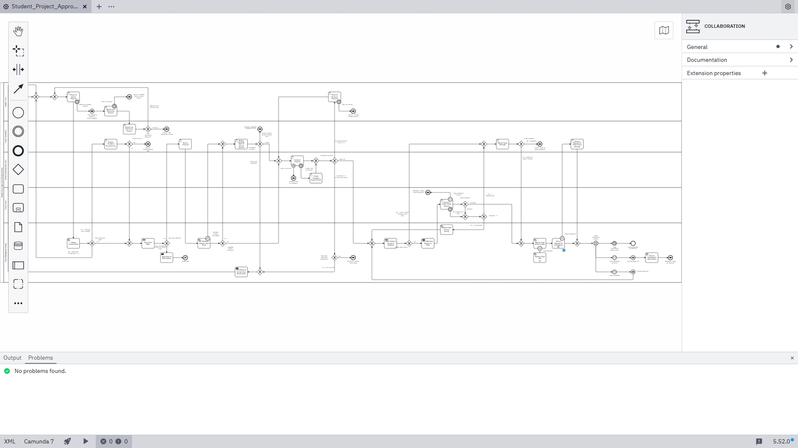
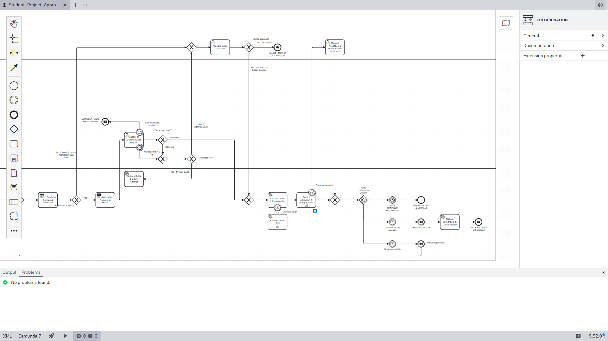

# Student Project Approval & Allocation System — BPMN 2.0 Model

**Assignment 1 · BPMN Project Assignments**

An editable BPMN 2.0 model of a department's final-year project approval and guide-allocation process, with its happy path, thirteen documented failure paths, and the supporting register and justification documents.

## Contents

1. [Project overview](#1-project-overview)
2. [Complete BPMN diagram](#2-complete-bpmn-diagram)
3. [Failure-path diagrams](#3-failure-path-diagrams)
4. [Failure Path Register (summary)](#4-failure-path-register-summary)
5. [Task and gateway justification](#5-task-and-gateway-justification)
6. [Process outcomes](#6-process-outcomes)
7. [Validation and evidence](#7-validation-and-evidence)
8. [Opening the model in Camunda Modeler](#8-opening-the-model-in-camunda-modeler)
9. [Known limitations](#9-known-limitations)

---

## 1. Project overview

**Objective.** Model the full life cycle of a student project proposal: draw the happy path, identify every realistic failure, design a resolution for each failure inside the diagram, and justify the task types and gateways used.

**Process.** A student team submits a proposal. The system validates the data and the team rules, the coordinator screens it, a similarity check looks for duplicate topics, and the review committee approves, asks for revision, or rejects. After approval a guide is matched by domain and workload, asked to accept, and the allocation is recorded and communicated. The process ends when the allocation is confirmed, or when the proposal is closed as rejected, invalid, lapsed or withdrawn.

**Participants.** One pool with five lanes:

| Lane | Responsibility |
|---|---|
| Student / Team | Submit, request late submission, revise |
| Project Coordinator | Screen, review similarity matches, decide late requests, handle escalations, allocate manually, manual fallback |
| Review Committee (incl. HoD) | Evaluate the proposal; HoD decides when the committee is overdue |
| Faculty Guide | Accept or decline the allocation request |
| Project Management System | Validation, rules, similarity check, matching, notifications, recording |

**Tools used.**

| Purpose | Tool |
|---|---|
| Opening, checking and exporting the diagram | Camunda Modeler 5.52.0 (desktop) |
| Parsing and reference checks | `bpmn-moddle` 10.3.1 |
| BPMN lint rules | `bpmnlint` 11.14.0, `bpmnlint:recommended` rule set |
| SVG → PNG / PDF conversion | Headless Google Chrome |

**Repository structure.**

```
README.md
bpmn/
  Student_Project_Approval.bpmn        editable BPMN 2.0 model (main process + sub-process diagram)
docs/
  Process_Overview.md                  scenario, lanes, happy path, process data
  Failure_Path_Register.md             full register, loop limits, end events
  Task_Gateway_Justification.md        reasons for task types, gateways, events
exports/
  Student_Project_Approval_Full.png / .pdf / .svg
  Student_Project_Approval_Happy_Path.png / .svg
  Student_Project_Approval_Failure_Paths.png / .svg
  Student_Project_Approval_Section_1…4_*.png
  Student_Project_Approval_Subprocess_Record_Allocation.png / .pdf / .svg
  Camunda_Modeler_Window_*.png         screenshots of the file open in Camunda Modeler
tools/
  validate.mjs                         structural checks (see section 7)
package.json, .bpmnlintrc              to re-run the checks
```

---

## 2. Complete BPMN diagram

The full main process, five lanes, start to all end events. The image is wide; click it to open at full resolution, or use the [PDF](exports/Student_Project_Approval_Full.pdf) / [SVG](exports/Student_Project_Approval_Full.svg) for lossless zoom.


*Figure 1 — Complete process.*

**Happy path.** The same diagram with the happy-path elements coloured green: submit → validate → team rules → screen → similarity check → committee approval → guide match → request → guide accepts → reserve slot → record and notify → confirmation window closes → *Project allocated & confirmed*. The step-by-step table is in the [Process Overview](docs/Process_Overview.md#happy-path).


*Figure 2 — Happy path (green).*

**Readable sections.** The full process cut into four overlapping sections at the same scale:

| Section | What it covers | Image |
|---|---|---|
| 1 | Submission, deadline, data validation, team rules (F1, F2, F4) | [Section 1](exports/Student_Project_Approval_Section_1_Submission_Validation.png) |
| 2 | Screening, similarity review, committee decision, revision, rejection (F3, F5, F6, F7, F12) | [Section 2](exports/Student_Project_Approval_Section_2_Screening_Review.png) |
| 3 | Guide matching, request, decline / timeout, manual allocation (F8, F9, F13) | [Section 3](exports/Student_Project_Approval_Section_3_Guide_Allocation.png) |
| 4 | Slot reservation, recording, confirmation window, withdrawal (F10, F11) | [Section 4](exports/Student_Project_Approval_Section_4_Recording_PostAllocation.png) |

---

## 3. Failure-path diagrams


*Figure 3 — Every element that is not on the happy path, coloured red: boundary events, retry and revision loops, escalation tasks, and the non-success end events.*


*Figure 4 — Submission and validation. F4: timer boundary on the submission task, late-submission request and coordinator decision. F1: return of the error list with a two-attempt limit, then escalation to the coordinator. F2: team-rule violation ending in the error end event "Invalid team".*


*Figure 5 — Screening and committee review. F3/F12: similarity match or service outage routed to coordinator review. F5: revision loop with 7-day timer. F6: rejection with one new-topic submission. F7: non-interrupting reminder timer and interrupting escalation timer to the HoD.*


*Figure 6 — Guide allocation. F8: no eligible guide → manual allocation or waiting list. F9: decline or 5-day silence → exclude guide and retry, three attempts, then manual allocation. F13: team withdrawal while the request is pending.*


*Figure 7 — Recording and confirmation. F10: error boundary on the sub-process leading to the manual fallback. F11: event-based gateway waiting for withdrawal, guide unavailability or the window timer; compensation releases the guide slot.*


*Figure 8 — Inside the collapsed sub-process "Record Allocation & Notify Parties" (F10): database write, then the two notifications in parallel, each with an error boundary event, a three-retry loop with a 5-minute wait, and an error end event when retries are exhausted.*

---

## 4. Failure Path Register (summary)

The complete register, with detection mechanism and the exact diagram labels for each failure, is in [`docs/Failure_Path_Register.md`](docs/Failure_Path_Register.md).

| ID | Failure scenario | Trigger | BPMN-based solution | Retry / deadline limit | Final outcome |
|---|---|---|---|---|---|
| F1 | Incomplete or invalid proposal data | Missing fields, no abstract, invalid roll numbers | Exclusive gateway after the validation service task; error list returned and team resubmits; escalation to a coordinator user task | 2 attempts, then escalation | Continues, or "Closed – invalid proposal data" |
| F2 | Team-rule violation | Team too large, or member already in another team | Business rule task → exclusive gateway → send task → error end event | None within the instance | "Invalid team" |
| F3 | Duplicate / plagiarised topic | Similarity score above threshold | Coordinator user task reviews and records; exclusive gateway: cleared / modify topic / reject | 1 topic modification | Continues, resubmission, or "Rejected – duplicate / plagiarised topic" |
| F4 | Missed submission deadline | No submission before the deadline | Interrupting timer boundary event; message throw event notifies; late request decided by the coordinator | Request within 3 days; 1 extension | Back to submission, or one of two "Lapsed" ends |
| F5 | Committee requests revision | Scope, objective or novelty concerns | Exclusive gateway branch into a revision loop with a timer boundary event | 7 days per revision; 2 cycles | Back to review, "Lapsed – revision deadline missed", or rejection path |
| F6 | Committee rejects | Not feasible, out of syllabus, no resources; or revision limit reached | Exclusive gateway; send task with reasons; loop to submission | 1 new-topic submission | Resubmission, or "Rejected – reasons sent to team" |
| F7 | Review delayed | No committee decision within the SLA | Non-interrupting timer boundary (reminder) and interrupting timer boundary (HoD decides) | Reminder at 5 days, escalation at 10 days | A decision is always produced |
| F8 | No suitable guide | Domain mismatch or all guides at maximum load | Business rule task returns "none" → coordinator user task → exclusive gateway | Single manual decision | Allocation continues, or "Closed – team on guide waiting list" |
| F9 | Guide declines or is silent | Decline, or no response | Exclusive gateway and timer boundary event; service task excludes the guide; loop to matching | 5 days to respond; 3 attempts | Next guide, then manual allocation |
| F10 | Notification or database failure | E-mail service down, DB write error | Error boundary events with retry loops inside a sub-process; error end event caught by an error boundary on the sub-process; coordinator fallback task | 3 retries per step, 5-minute wait | Allocation recorded automatically or manually |
| F11 | Withdrawal or guide unavailable after allocation | Team dissolves; guide goes on leave | Event-based gateway with message and timer events; compensation releases the guide slot | Within the 7-day confirmation window | "Withdrawn – guide slot released", or back to guide matching |
| F12 | Similarity service unavailable *(additional)* | Technical outage | Error boundary event on the service task → coordinator review | One manual review | Same outcomes as F3 |
| F13 | Withdrawal while guide request is pending *(additional)* | Team withdraws before a guide accepts | Interrupting message boundary event on the guide's task | — | "Withdrawn – guide request cancelled" |

---

## 5. Task and gateway justification

Summary of the modelling choices; the detailed version, element by element, is in [`docs/Task_Gateway_Justification.md`](docs/Task_Gateway_Justification.md).

- **User, service and business rule tasks.** Work done by a person through a form is a user task and sits in that person's lane. Fully automated work (validation, similarity call, database updates) is a service task in the system lane. The two policy decisions that are naturally decision tables — team rules, and guide matching by domain and workload — are business rule tasks. Pure notifications are send tasks.
- **Exclusive gateways for approval, revision and rejection.** Every decision in the process is a choice of exactly one path from data that already exists, so all decision gateways are exclusive. The committee gateway has three branches; the revision branch carries the condition `revisionCount < 2`, so after two cycles only approve or reject remain. Merges are separate, unlabelled exclusive gateways; no gateway both joins and splits.
- **Timer boundary events for deadlines and review delays.** Deadlines belong to the task that is waiting, so they are boundary events on that task: submission deadline, 3-day late request, 7-day revision, 5-day guide response. The committee task has two: a non-interrupting one for the reminder (the review must stay open) and an interrupting one for the escalation.
- **Error boundary events for technical failures.** Used only where software can fail: the similarity service, the database write and the two notifications. Expected business outcomes ("invalid", "declined") are gateway branches, not errors.
- **Bounded retry loops and revision limits.** Each loop is an explicit sequence-flow loop with a counter condition on the gateway that exits it; all limits are listed in the [register](docs/Failure_Path_Register.md#bounded-loops-at-a-glance).
- **Escalation to the coordinator or HoD.** Two failed validation attempts, an unmatched guide, three failed allocation attempts and exhausted technical retries all go to coordinator user tasks; an overdue committee decision goes to the HoD. Escalation is modelled with gateway branches and boundary events leading to a named task. A BPMN escalation event is not used because, at process level, nothing would catch it.
- **Guide reallocation and compensation after withdrawal.** The slot is reserved by "Allocate Guide & Reserve Slot", which has a compensation boundary event linked to the handler "Release Guide Slot". Withdrawal or guide unavailability triggers a compensation throw event; withdrawal then closes the project, guide unavailability returns to guide matching.
- **Parallel gateway.** Used once, in the sub-process: notifying the team and notifying the guide are independent and both required, so they run between a matched AND split and AND join. The validation checks are not parallel because each can stop the proposal before the next is worth running.
- **Event-based gateway.** Used once, after allocation: the process waits for whichever comes first of a withdrawal message, a guide-unavailability message, or the confirmation timer. It is not used for the guide's answer, because that wait happens on a user task where boundary events express the same race.

---

## 6. Process outcomes

| Outcome | End event in the diagram | When |
|---|---|---|
| **Successful allocation** | Project allocated & confirmed | Guide accepted, allocation recorded, team and guide notified, 7-day confirmation window closed without withdrawal |
| **Rejected** | Rejected – reasons sent to team | Committee rejection (or exhausted revisions) after the one new-topic submission has been used |
| **Rejected** | Rejected – duplicate / plagiarised topic | Coordinator rejects after the similarity review |
| **Invalid team** | Invalid team *(error end event)* | Team-rule violation |
| **Invalid data** | Closed – invalid proposal data | Coordinator cannot resolve escalated validation errors |
| **Lapsed** | Lapsed – deadline missed, no late request | Deadline passed and no late request within 3 days |
| **Lapsed** | Lapsed – late submission refused | Coordinator refuses the late request |
| **Lapsed** | Lapsed – revision deadline missed | No revision within 7 days |
| **Unallocated** | Closed – team on guide waiting list | No guide could be assigned |
| **Withdrawn** | Withdrawn – guide request cancelled | Team withdraws while a guide request is pending |
| **Withdrawn** | Withdrawn – guide slot released | Team withdraws after allocation; slot released by compensation |

---

## 7. Validation and evidence

All checks below were run on the committed `bpmn/Student_Project_Approval.bpmn` (SHA-256 `92c962e3c528eea3310f230845a11348ebfa4f03b846a3223c1e1c174b492ae0` at export time).

### Checks performed

| Check | Tool | Result |
|---|---|---|
| XML well-formedness | Python `xml.dom.minidom`, and the parsers below | Parsed without error |
| BPMN 2.0 element / attribute typing and ID references | `bpmn-moddle` 10.3.1 | 0 warnings; all 743 references resolve; 478 IDs unique |
| Opens in Camunda Modeler | Camunda Modeler 5.52.0 | Both diagrams import; Problems panel: "No problems found" (0 errors, 0 warnings) |
| BPMN lint | `bpmnlint` 11.14.0, `bpmnlint:recommended` | 0 errors, 0 warnings |
| Sequence flows: source and target exist in the same scope, `incoming` / `outgoing` consistent | `tools/validate.mjs` | Pass (81 main, 22 sub-process) |
| No dead ends; every node has an incoming flow; end events have no outgoing flow | `tools/validate.mjs` | Pass |
| Reachability: every node reachable from the start event, and every node can reach an end event | `tools/validate.mjs` | Pass (78 main, 22 sub-process nodes) |
| Gateways: no mixed join/split; every exclusive split has a question label and a labelled, conditioned branch; event-based gateway targets are catch events; parallel split and join matched | `tools/validate.mjs` | Pass (25 main, 8 sub-process gateways) |
| No implicit splits or merges on tasks | `tools/validate.mjs` | Pass |
| Boundary events attached to an activity in the same scope and typed | `tools/validate.mjs` | Pass (10 main, 3 sub-process) |
| Compensation: boundary event associated with a handler; throw events reference a compensable activity | `tools/validate.mjs` | Pass |
| Sub-process error end events caught by an error boundary with the same error reference | `tools/validate.mjs` | Pass |
| Loops bounded by a counter condition | `tools/validate.mjs` | Pass (9 loops; the reallocation loop is bounded by an external message and the window timer instead of a counter) |
| Lanes: every node in exactly one lane; automated tasks in the system lane, user tasks in human lanes | `tools/validate.mjs` | Pass |
| Every element has a diagram shape or edge | `tools/validate.mjs` | Pass (210 elements) |
| Register ↔ model consistency | Script comparing every label quoted in `docs/` with the `name` attributes in the BPMN file | Every quoted label exists in the model |
| Visual inspection of the exported images | Manual | Label overlaps found in early renders were fixed and the images re-exported |

**Not performed:** validation against the OMG BPMN 2.0 XSD files, and execution or token simulation on a process engine (the model is descriptive, `isExecutable="false"`).

To re-run the scripted checks:

```
npm install
npm run validate
npm run lint
```

### How the images were produced

- The `.svg` files in `exports/` were produced by **Camunda Modeler 5.52.0** with the BPMN file open in it. The export was triggered by a script through the application's debugging interface, calling the editor's own SVG export, rather than by clicking *File → Export as image*; the output is the same diagram Camunda Modeler draws on screen.
- The `.png` and `.pdf` files are those SVGs converted by headless Google Chrome at 2× scale, and the four section images are crops of the full SVG. Chrome only rasterises; it does not lay out or draw the BPMN.
- For the happy-path and failure-path images, colours were applied temporarily in Camunda Modeler before export and then undone. The colours are **not** stored in the `.bpmn` file.
- The `Camunda_Modeler_Window_*.png` files are unedited screenshots of the Camunda Modeler window:



*Figure 9 — The file open in Camunda Modeler 5.52.0, Problems panel: "No problems found".*



*Figure 10 — Guide-allocation and confirmation area in the Camunda Modeler canvas.*

### Files

- Editable model: [`bpmn/Student_Project_Approval.bpmn`](bpmn/Student_Project_Approval.bpmn)
- [Process Overview](docs/Process_Overview.md) · [Failure Path Register](docs/Failure_Path_Register.md) · [Task and Gateway Justification](docs/Task_Gateway_Justification.md)
- Vector exports: [full PDF](exports/Student_Project_Approval_Full.pdf) · [full SVG](exports/Student_Project_Approval_Full.svg) · [sub-process PDF](exports/Student_Project_Approval_Subprocess_Record_Allocation.pdf)

---

## 8. Opening the model in Camunda Modeler

1. Download Camunda Modeler from <https://camunda.com/download/modeler/> and start it (the Windows build is a zip; unpack it and run `Camunda Modeler.exe`).
2. *File → Open File…* and choose `bpmn/Student_Project_Approval.bpmn`. It opens as a BPMN diagram; no plugins are needed.
3. Scroll and zoom to navigate (Ctrl + mouse wheel, or *Window → Fit Diagram*).
4. To see inside the sub-process, click the small blue arrow at the bottom-right of **Record Allocation & Notify Parties**; use the breadcrumb at the top-left of the canvas to return.
5. Click any gateway branch and open *Condition* in the properties panel to see the limit that guards it. The **XML** button at the bottom-left shows the source.
6. The **Problems** indicator in the status bar shows lint results.
7. To export: *File → Export as image…* and choose PNG, JPEG or SVG. The export covers the diagram currently shown, so export once on the main process and once inside the sub-process.

The file is plain BPMN 2.0 with standard namespaces only, so it also opens in <https://demo.bpmn.io> and other BPMN 2.0 tools.

---

## 9. Known limitations

- **Descriptive, not executable.** Tasks have no engine implementation and the counters named in the conditions are not incremented by dedicated tasks; where each is updated is stated in the [Process Overview](docs/Process_Overview.md#process-data-used-in-conditions).
- **Technical retries are modelled only for the allocation record and the two allocation notifications (F10).** Other notifications (the send tasks and message end events on rejection and lapse paths) have no retry loop in the diagram.
- **Withdrawal is caught at two points:** while a guide request is pending (F13) and during the confirmation window (F11). A withdrawal that arrives during another step, for example while the coordinator is allocating manually, is not modelled.
- **The HoD's escalated decision has no further timer.**
- **Single pool.** Because the five participants are lanes of one pool, there are no message flows; communication is shown with send tasks and message events.
- **Assumed durations.** Values the brief does not specify (5/10-day committee SLA, 5-day guide response, 3-day late-request window, 7-day confirmation window, 5-minute retry wait) are assumptions and are listed in the [register](docs/Failure_Path_Register.md#assumptions).
- **Layout.** The lane order follows the brief, which places the system lane furthest from the student lane, so several flows run vertically across the three lanes in between and a few flows cross.
